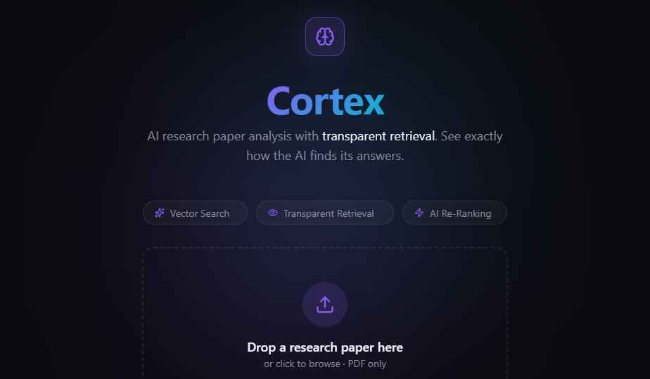
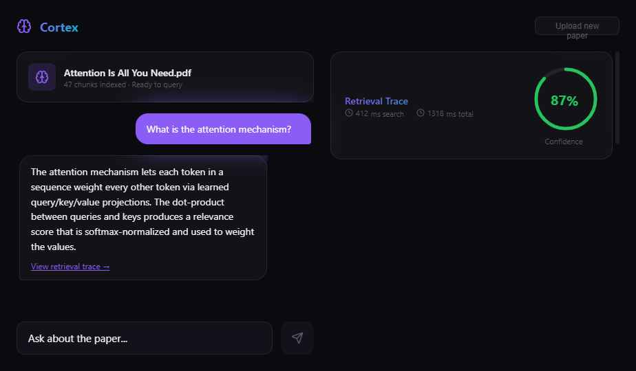

# Cortex

AI research paper analysis with **transparent retrieval**. Upload a paper, ask questions, and see exactly how the AI finds its answers.




## The Problem

Every AI chatbot is a black box. You ask a question, get an answer, and have no idea whether it's grounded in real data or completely hallucinated. There's no way to verify *how* the AI arrived at its response.

## What Cortex Does

Cortex is a **glass-box** research assistant. When you ask a question about an uploaded paper, it doesn't just give you an answer — it shows you the entire retrieval pipeline:

1. **Vector Search** — which chunks of the paper were retrieved and their cosine similarity scores
2. **AI Re-Ranking** — how a second pass reordered results by contextual relevance (with movement indicators)
3. **Context Window** — the exact text that was fed to the LLM
4. **Confidence Score** — a visual indicator of answer reliability



## How It Works

```
PDF Upload → Text Extraction → Chunking → Gemini Embeddings → Supabase pgvector
                                                                      ↓
User Query → Embed Query → Vector Similarity Search → LLM Re-Ranking → Gemini Answer
                                                                      ↓
                                                        Full Retrieval Trace → UI
```

**Upload pipeline:**
- PDF text extraction via `unpdf`
- Recursive text chunking (800 chars, 150 overlap)
- Embedding via `gemini-embedding-001` (3072 dimensions)
- Storage in Supabase with pgvector for similarity search

**Query pipeline:**
- Query embedding → cosine similarity search (top 8 chunks)
- LLM-based re-ranking to reorder by contextual relevance
- Top 3 re-ranked chunks assembled into context window
- Gemini generates a grounded answer
- Full retrieval metadata returned to the frontend

## Tech Stack

| Layer | Tech |
|-------|------|
| Frontend | Next.js 16, React, TypeScript, Tailwind CSS, Framer Motion |
| Backend | Next.js API Routes |
| Database | Supabase (PostgreSQL + pgvector) |
| LLM | Google Gemini 2.5 Flash |
| Embeddings | Gemini Embedding 001 (3072-dim) |
| PDF Parsing | unpdf |
| Deployment | Vercel |

## Running Locally

```bash
# Clone the repo
git clone https://github.com/Yashpython/cortex.git
cd cortex

# Install dependencies
npm install

# Set up environment variables
cp .env.example .env.local
# Add your Supabase URL, Supabase Anon Key, and Gemini API Key

# Set up the database
# Run supabase-setup.sql in your Supabase SQL Editor

# Start the dev server
npm run dev
```

## Environment Variables

```
NEXT_PUBLIC_SUPABASE_URL=your_supabase_project_url
NEXT_PUBLIC_SUPABASE_ANON_KEY=your_supabase_anon_key
GEMINI_API_KEY=your_gemini_api_key
```

## Project Structure

```
src/
├── app/
│   ├── api/
│   │   ├── upload/route.ts    # PDF processing pipeline
│   │   └── query/route.ts     # Vector search + re-ranking + generation
│   ├── page.tsx               # Landing + chat interface
│   ├── layout.tsx             # Root layout with Inter font
│   └── globals.css            # Design system tokens
├── components/
│   ├── UploadZone.tsx         # Drag-and-drop PDF upload
│   ├── ChatInterface.tsx      # Split-view chat + trace panel
│   └── RetrievalPanel.tsx     # Retrieval transparency visualization
└── lib/
    ├── gemini.ts              # Gemini embeddings + chat client
    ├── supabase.ts            # Supabase client
    ├── chunker.ts             # Text chunking utility
    └── types.ts               # Shared TypeScript types
```
